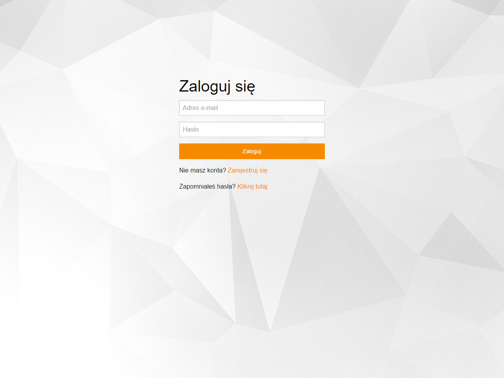

# domestic

![Language][language-url] ![Meteor][meteor-url] ![License][license-url] ![Version][version-url] ![Done][done-url] ![Maintenance][maintenance-url]

### System for collecting and analysing data from [Domestic](http://www.domestic.gda.pl/) initiative

##### This project was developed for *Medical telematics* classes at Electronics, Telecommunications and Informatics faculty of Gdańsk University of Technology. Project will be no maintained.

## Main features

- Made as SPA (single-page application) with [Meteor](https://www.meteor.com/) framework
- [ZURB Foundation](http://foundation.zurb.com/) Sass as CSS framework
- [Blaze](http://blazejs.org/) template engine is used
- REST API
- MongoDB [GridFS](https://docs.mongodb.com/manual/core/gridfs/)
- Account verification with email

## Screenshots

  
  
  
  
  
  
  
  
  
  
 

## Used libraries/modules

- [accounts-password](https://atmospherejs.com/meteor/accounts-password)
- [reactive-dict](https://atmospherejs.com/meteor/reactive-dict)
- [reactive-var](https://atmospherejs.com/meteor/reactive-var)
- [meteorhacks:ssr](https://atmospherejs.com/meteorhacks/ssr)
- [kadira:blaze-layout](https://atmospherejs.com/kadira/blaze-layout)
- [kadira:flow-router](https://atmospherejs.com/kadira/flow-router)
- [nimble:restivus](https://atmospherejs.com/nimble/restivus)
- [momentjs:moment](https://atmospherejs.com/momentjs/moment) | Moment.js
- [less](https://atmospherejs.com/meteor/less)
- [zurb:foundation-sites](https://atmospherejs.com/zurb/foundation-sites) | ZURB Foundation
- [fortawesome:fontawesome](https://atmospherejs.com/fortawesome/fontawesome) | FontAwesome
- [chart:chart](https://atmospherejs.com/chart/chart) | Chart.js
- [meteorhacks:aggregate](https://atmospherejs.com/meteorhacks/aggregate)
- [tmeasday:publish-counts](https://atmospherejs.com/tmeasday/publish-counts)
- [ovcharik:alertifyjs](https://atmospherejs.com/ovcharik/alertifyjs)
- [udondan:jszip](https://atmospherejs.com/udondan/jszip) | JSZip
- [rajit:bootstrap3-datepicker](https://atmospherejs.com/rajit/bootstrap3-datepicker)
- [perak:joins](https://atmospherejs.com/perak/joins)
- [cfs:gridfs](https://atmospherejs.com/cfs/gridfs)
- [random](https://atmospherejs.com/meteor/random)
- [vex](https://github.com/hubspot/vex)
- [spin.js](http://spin.js.org/)

[language-url]: https://img.shields.io/badge/language-JavaScript-lightgrey.svg?style=flat "Language"
[meteor-url]: https://img.shields.io/badge/Meteor-1.3.2.4-de4f4f.svg?style=flat "Meteor"
[license-url]: https://img.shields.io/badge/license-Apache%202-blue.svg?style=flat "License"
[version-url]: https://img.shields.io/badge/version-1.0.0-brightgreen.svg?style=flat "Version"
[done-url]: https://img.shields.io/badge/done-05.2016-yellow.svg?style=flat "Done"
[maintenance-url]: https://img.shields.io/maintenance/no/2016.svg?style=flat "Maintenance"
